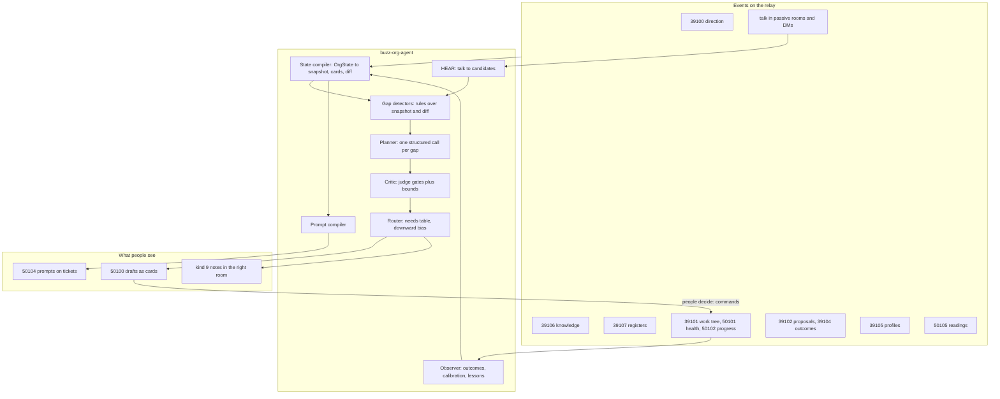

# Organizational state and the change engine

This document answers two questions:

1. **What does the org agent need to know** — what organizational state —
   to suggest the projects, tickets, and ticket prompts an experienced
   operator in this organization would suggest?
2. **What system turns that state into those suggestions**, keeps them
   true as the state moves, and gets better from what happens next?

The [short version](./intelligent-org-state-and-planning-brief.md) is the
one to judge the system by. This document is the full design.

It builds on four documents and does not repeat them:
[Full project context](../product/intelligent-org-project-context.md) (the
thirty categories of context, and what each one prevents),
[Organizational Intelligence](./organizational-intelligence.md) (the memory
layers and the context budget), the [Org agent](./intelligent-org-agent.md)
design (runtime, jobs, judge), and the proactive-agent plan (org knowledge,
project context, repo digest, jobs P1–P5). What this document adds is the
**frame** those pieces were missing: organizational context is *state*, a
project is a *proposed change to that state*, and projects, tickets, and
prompts are **one plan seen at three levels of detail**.

---

## Contents

- [The short answer](#the-short-answer)
- [1. Two realizations, made precise](#1-two-realizations-made-precise)
- [2. The organizational state model](#2-the-organizational-state-model)
- [3. What the engine produces](#3-what-the-engine-produces)
- [4. The change engine](#4-the-change-engine)
- [5. Worked examples](#5-worked-examples)
- [6. Measuring it](#6-measuring-it)
- [7. Tensions with the current design](#7-tensions-with-the-current-design)
- [8. Build order](#8-build-order)
- [9. Open questions](#9-open-questions)

---

## The short answer

**A project is a proposed change to the organization's state.** It says
where some part of the org is now, where it should be, why this change and
not another, and how anyone will know it happened. Tickets are the path
from "now" to "then", broken into pieces one person can hold. A prompt is
one ticket compiled into instructions an AI agent (or a person) can carry
out without asking. All three come from the same reasoning about the same
state, so the agent should **draft them as one plan and commit them in
stages**: Shapers vote on the change, the holder owns the path, and each
piece gets its prompt when someone is about to do it.

**The organizational state the agent needs has eight parts:**

| Part | The question it answers | Mostly written by |
| --- | --- | --- |
| **Desired state** | Where are we trying to get, and how will we know we got there? | Shapers (direction) |
| **Current state** | Where are we now, what is working, what is hurting? | Shapers (situation), live readings, members (signals) |
| **Change in flight** | What are we already doing about it, and how is it going? | The system (work tree, health, progress) |
| **Capacity** | Who and what can we use — people, time, assets, code, partners? | Each person; Shapers; the system |
| **Bounds** | What must a change never do or break? | Shapers |
| **Causal model** | Why do we believe doing X moves Y? | Shapers; lessons from closed work |
| **Uncertainty** | What don't we know yet that decides what to do first? | Shapers, holders |
| **Memory** | What did we try, decide, and refuse, and what happened? | The system, from the ledger |

The [thirty categories](../product/intelligent-org-project-context.md#the-categories)
all fit into these eight parts. The parts are what make the context
*usable*. A planner does not reason over "category 18". It reasons over
"goal, start, moves available, rules, expected effects, unknowns, track
record".

**The system has six stages:**

```
events ──► STATE COMPILER ──► GAP DETECTORS ──► PLANNER ──► CRITIC ──► ROUTER ──► people decide
  ▲          (no model)         (rules)          (model)    (rules)    (table)        │
  └────────────── OBSERVER: progress, done, readings, outcomes ◄───────────────────────┘
```

Rules decide *when* to run and *whether* a draft may leave; the model
decides only *what to suggest and why*. This is the existing "rules trigger,
models explain" principle carried through to planning.

**What changes against today's design, in order of leverage:**

1. A **state compiler** inside the agent that turns the event log into
   per-objective, per-project, and per-ticket *state cards*. No protocol
   change is needed.
2. One **change plan** schema. The project draft carries the change
   (from → to, done when) and the whole first plan, and the existing J2
   `coverage` becomes that plan, carried forward rather than reinvented.
3. **Definitions on objectives.** Each line names its measure and its "done
   when" (definitions only, never values). Strategy lines say whether
   they are a bet, a rule, or a refusal.
4. **Ticket prompts** (`50104`) compiled from a ticket's state card, with
   the repo digest for code work.
5. **Registers** for the fast-moving parts of state that have no home
   today: open questions, assumptions, signals, commitments, dependencies.
6. **Readings**, so the current state has numbers without writing any of
   them into memory.
7. **Outcome learning.** At close, compare the change's "to" with what
   happened, and feed the gap back as calibration and lessons.

---

## 1. Two realizations, made precise

### 1.1 Projects and tickets are one plan at different resolutions

They feel like two things in the current design for two good reasons, and
neither reason is about the content:

- **Different decision rights.** A project is a new root, so the Shapers
  vote on it (level 3). A ticket is the holder's call (level 1)
  ([Organizational Intelligence § 8](./organizational-intelligence.md#8-decision-rights--what-becomes-a-proposal)).
- **Different timing.** J1 drafts the project when direction changes. J2
  drafts tickets only after a holder accepts, because tickets are addressed
  to the holder and there is no holder before that.

In *content*, though, they are inseparable:

- **A project cannot be sized without its decomposition.** "Open a weekday
  hall" is a four-week project if the licence exists and a four-month one if
  it doesn't. The agent only knows which by planning the steps.
- **A project cannot be judged without its first step.** If the first
  sensible step is a test (a trial night, a site survey), then *that* is the
  project, and the build waits behind it. The design already says this
  ([Org agent § 8.6](./intelligent-org-agent.md#86-per-move-specifics), "J1
  plans in order too"), but J1 cannot honour it reliably without
  decomposing.
- **Tickets cannot be judged without the change they serve.** "Done when"
  on a ticket only means something relative to the project's "done when".
  A ticket list that does not add up to the project's end state is
  incomplete, however good each ticket is.
- **Shapers decide better with the plan in view.** A Shaper voting on
  "Weekday hall, by August" is really voting on "a licence, a hygiene
  certificate, a four-week trial, then a regular night". Showing that is
  the difference between a vote and a guess.

**The rule: draft whole, commit in stages.**

| Stage | What is drafted | Who commits it | What their commitment means |
| --- | --- | --- | --- |
| Change | The change (from → to, done when, objective, date, why) **plus the full first plan** as a preview | Shapers, by vote (`io_project_propose`) | "This change is worth making, by this date." Not "this exact plan". |
| Path | The plan's first wave: pieces that can start now; gates first | The holder, piece by piece (`io_ticket_create`) | "These are the next steps." The holder owns and may reshape the plan. |
| Next wave | Pieces held behind a gate, re-planned with what the gate learned | The holder | "Given what we now know, these next." |
| Execution | A prompt per task ticket | Nobody needs to commit: it is a read | "Here is how to do this piece." |

This keeps the governance model exactly as it is: Shapers approve the
*what and why*, the holder owns the *how*. It changes only what the agent
drafts and when. The existing J2 `coverage` list is already "the whole
ordered plan for the parent brief"
([Protocol §4.3](./intelligent-org-protocol.md#43-kind50100--draft)), so
the change is to **produce it in J1, carry it on the project, and let J2
start from it** instead of inventing a new one after the holder accepts.

The recursion holds too. A ticket big enough to split is a smaller change
with its own path. The same planner runs one level down, with the parent
ticket as its "desired state", which matches the tree: "a project is a
ticket with nothing above it."

### 1.2 Organizational context is state, and a project is a transition

The difference between knowledge and state is the difference between a
list and a situation:

> **Knowledge:** "We have three engineers."
>
> **State:** "We have three engineers. Two are holding the relay work until
> 15 November. One has about a day a week free. Backend capacity is the
> bottleneck for objective 2."

Only the second lets anyone decide anything. The agent needs state.

Treating the org as state brings in a well-understood frame: **planning**.
A planner needs a goal, a start, the moves available, what each move needs
before it can happen, what each move is expected to do, the rules no move
may break, and a record of how past moves actually turned out. Each maps
directly onto the org:

| Planning concept | In the organization | Example (River Commons) | Part of state |
| --- | --- | --- | --- |
| Goal state | Objectives with their measures and "done when" | "A weekday hall open before August: one session a week, four weeks running" | Desired |
| Start state | Situation, readings, what is working or stuck | "Never run a weekday night; no evening licence" | Current |
| Moves in progress | Live projects, their plans and health | "Grower onboarding (Jun, wobbly)" | Change in flight |
| Available means | People, time, assets, code, partners | "Church hall Tue/Thu from 17:00; Tomasz knows the licensing officer" | Capacity |
| Preconditions | What a move needs first | "Cooked food needs a hygiene certificate per session" | Bounds and uncertainty |
| Rules | Red lines, constraints, commitments, governance | "No brand money. Hall closes at 22:00." | Bounds |
| Expected effect | Why we think this move moves the goal | "Weekly habit → predictable income → more growers" | Causal model |
| Unknowns | Open questions, assumptions | "Will weekday buyers come?" | Uncertainty |
| Track record | What past moves actually did | "The February pop-up drew eight people" | Memory |

From this frame, five design consequences follow. The rest of the document
is built on them:

1. **Every project declares its transition**: `from` (the relevant current
   state, in words), `to` (the desired state it reaches), and `done_when`
   (the observable check). A project that cannot say these is an activity,
   not a change.
2. **The gap is computed, not imagined.** The agent's first job is the
   difference between desired and current state, minus what is already in
   flight. The model explains the gap; it does not invent it
   ([Organizational Intelligence § 6](./organizational-intelligence.md#6-how-we-make-the-ai-intelligent)).
3. **Uncertainty decides order.** When a precondition is unknown, the right
   first move is the one that finds out: a *gate*. Plans are built gates
   first.
4. **Closing a project is a measurement.** On close, compare `to` with what
   actually happened. The difference is the most valuable thing the org can
   learn about its own causal model and estimates.
5. **The state must stay true.** A plan built on a stale situation is
   confidently wrong. Keeping state fresh is a job the agent does
   proactively, by drafting refreshes for people to confirm.

---

## 2. The organizational state model

### 2.1 Rules every piece of state follows

These carry over unchanged from
[Organizational Intelligence](./organizational-intelligence.md) and the
[context properties](../product/intelligent-org-project-context.md#properties-every-piece-of-context-needs);
they are restated because the state model depends on all of them:

- **Beliefs are confirmed; facts are recorded; readings are fetched.** A
  belief (an objective, a strategy line, a red line) is written only by a
  passed proposal. A fact (an item is done, a vote passed) is written by the
  relay from a command. A reading (stall takings this week) is fetched at
  the moment of use, and never written into a belief.
- **Every element has provenance**: who confirmed or recorded it, when, and
  from what. A suggestion's claims cite these.
- **Every element has a kind**: fact, belief, assumption, or reading. The
  planner builds on facts and beliefs, tests assumptions, and reads readings
  with their age.
- **Every element has a freshness class** (stable, slow, fast, live) and an
  owner who keeps it true.
- **Negatives are first-class.** What the org will not do, has refused, or
  has parked is state, and it is the cheapest way to stop a wrong suggestion.
- **The curated parts stay small.** L3 must stay readable in an afternoon.
  The state model grows by **typed, bounded registers**, not by free text.

One new rule:

- **Every element of state says what it is about.** An open question names
  the objective or item it blocks. A constraint names what kind of work it
  binds. A signal names the objective it threatens. Without that link the
  compiler cannot put the right state in front of the right decision, and
  the agent falls back to sending everything, which
  [degrades accuracy](./organizational-intelligence.md#why-we-should-not-send-everything-even-when-we-can).

### 2.2 The eight parts

#### A. Desired state — where we are going and how we will know

| Element | Fields that matter for planning | Categories | Home |
| --- | --- | --- | --- |
| Purpose | what we do, for whom, the forms we refuse | 1 | `39100 mission` |
| Vision | the picture, its two to four measures, the horizon | 2 | `39100 vision` |
| **Objectives** | outcome; **measure** (what is counted, from where); **done_when** (the check on the date); date; the outside reason for the date; which vision measure it moves | 7 | `39100 objectives` lines; **add `measure` and `done_when` per line** |
| Priorities | order between objectives, explicit trade-offs, what is parked | 8 | `39100 strategy` prose today; **add a `priority` and `parked` to objective lines** |

The objective line is the most important element in the whole model:
every project cites one, and its `done_when` is what the gap is measured
against. Today a line is `{n, id, text, date}`. The proposal is to make it:

```jsonc
{ "n": 2, "id": "l_7f3a",
  "text": "A weekday hall is open before August",
  "date": 1785542400,
  "why_date": "the church's summer rate ends in August",
  "done_when": "one weekday session a week for four weeks running",
  "measures": [ { "id": "m1", "name": "weekday sessions held", "source": "ledger | reading | judgement" } ],
  "priority": 2,
  "parked": false }
```

`measures` are **definitions**: what is counted and where it comes from.
Their values are readings (part B), so no number enters L3.

#### B. Current state — where we are, and what is happening to us

| Element | Fields | Categories | Home |
| --- | --- | --- | --- |
| Situation | stage; what exists; what is proven vs assumed; what is stuck; the one thing to learn next; capacity and money in words | 11 (prose) | `39100 situation` (built) |
| **Readings** | measure id, value, unit, as-of, source, receipt | 11 (metrics), 15 (balances) | **new `50105 io_reading`** — person- or integration-signed, never L3 |
| **Signals** | type (problem, opportunity, request); what; evidence; severity; who is affected; what it threatens or serves | 5, 13, 25 | **new register (`39107`, type `signal`)** |
| Stage changes | a key person left, a partner arrived | 11 | situation redraft (agent drafts, Shapers confirm) |

Signals are ChatGPT's "problems and opportunities as first-class objects",
in this model's terms. They are the second source of projects after
uncovered objectives. A signal is not a belief: any member can raise one,
with evidence, at level 0. Shapers triage it; the agent clusters duplicates
and links each one to an objective.

#### C. Change in flight — what we are already doing

| Element | Fields | Categories | Home |
| --- | --- | --- | --- |
| Live projects | change (from → to), objective, holder, due, plan, coverage, health band and factors | 12 | `39101` roots, `50101` health; **add `change` and `plan` to roots** |
| Live tickets | state, holder, due, `after`, gate, last progress | 12 | `39101` children, `50102` |
| Open proposals and drafts | what is waiting for a decision, and since when | 12 | `39102`, `50100` + `39104` |
| Committed capacity | who holds what, against their own limit | 12, 14 | derived from the tree and `39105.open_limit` |

All of this already exists, apart from `change` and `plan` on a root. It is
the most reliable part of the state, because it is behaviour, not
self-description
([Organizational Intelligence § 1](./organizational-intelligence.md#1-four-layers-of-memory),
"behavioural evidence").

#### D. Capacity — what we can use

| Element | Fields | Categories | Home |
| --- | --- | --- | --- |
| People | skills, about, open limit; **availability (hours a week, days, time zone, planned absence)**; **wants to do or learn**; paid / volunteer | 14 | `39105`; **add availability and `wants_to`** |
| Org-level gaps | skills nobody has; build, borrow, or buy | 14 | knowledge section `people-and-roles` |
| Assets and tools | spaces (with availability and terms), equipment, accounts, licences and expiry | 16 | knowledge section `assets` |
| **Codebases** | repos (`30617` or GitHub URL), what each is, stack, conventions, owners; **the repo digest** | 16 | knowledge section `codebases` + project-linked repos + digest |
| Relationships | partner, what they can offer, who holds the relationship, its state | 17 | knowledge section `relationships` |
| Money posture | sources, posture in words, restricted money, typical cost, approval threshold | 15 | knowledge section `money` (no balances; balances are readings) |

#### E. Bounds — what no change may do

| Element | Fields | Categories | Home |
| --- | --- | --- | --- |
| Red lines and anti-goals | the refusal; where it came from; what it rules out | 3, 10 | `39100 strategy` lines typed `refusal`; knowledge section `principles` for the reasons |
| Constraints | legal, policy, contract, safety, practical; what kind of work each binds | 18 | knowledge section `constraints` |
| **Commitments** | to whom, what, by when, if missed | 19 | **register, type `commitment`** |
| Calendar | seasons, external windows, the org's rhythms | 20 | knowledge section `calendar` |
| Governance | who decides what, by what rule | 28 | `39103` (built) |
| Norms | project length and size, what done means, preferred patterns (pilot first), where work lives, language | 27 | knowledge section `norms` |

Bounds are what the critic checks every draft against (§ 4.5). Each one
must be written so that a check is possible: "no paid advertising" can be
checked; "we value openness" cannot.

#### F. Causal model — why we believe moves move things

| Element | Fields | Categories | Home |
| --- | --- | --- | --- |
| Strategy bets | the bet, why we believe it, **drop if** | 9 | `39100 strategy` lines typed `bet`, **add `drop_if`** |
| Theory of change | the chain, link by link; which links are proven | 4 | `39100 strategy` prose, or knowledge section `theory-of-change` |
| Playbooks | how this org does recurring work (onboard a grower, ship a release) | 26 | knowledge section `playbooks`; project `context/` docs |
| Lessons | what closed work taught, in one line each | 23 | **derived at close (§ 4.8)**; the beliefs among them drafted into strategy |

The causal model is what turns a gap into *candidate moves*. Without it the
planner proposes activity near the goal instead of activity that causes it
([category 4](../product/intelligent-org-project-context.md#4-theory-of-change)).

#### G. Uncertainty — what we do not know yet

| Element | Fields | Categories | Home |
| --- | --- | --- | --- |
| **Open questions** | the question; the decision it unlocks; how it could be answered; what it is about | 24 | **register, type `question`** |
| **Assumptions** | the claim; confidence in words; what would disprove it; what rests on it | 24 | **register, type `assumption`** |
| **External dependencies** | on whom, for what, expected when, how certain, what if not | 21 | **register, type `dependency`** |
| Risks | what, how likely, how bad, single points of failure, appetite | 22 | knowledge section `risks` |

Uncertainty is what decides **order**. A plan whose first piece rests on an
open question should start with the piece that answers it: the gate. When
a gate ticket closes, its holder records the answer, the question moves to
`answered`, and that is the trigger for the next wave (§ 4.6).

#### H. Memory — what we tried, decided, and refused

| Element | Fields | Categories | Home |
| --- | --- | --- | --- |
| Decisions | passed and rejected proposals with their reasons and votes | 23, 28 | `39102` (built) |
| **Refusals with conditions** | declined drafts with reason and **reconsider when** | 23, 30 | `39104` decline; **add `reconsider_when`** |
| Execution history | per closed project: planned vs actual (duration, pieces, holders), outcome against `to` | 23 | **derived at close (§ 4.8)** |
| Suggestion feedback | accepted, amended (with the edit), declined (with reason) per move, gap, and holder | 30 | `39104` (built) |
| Calibration | aggregates over execution history ("projects here run 1.6× their date") | 23, 30 | **computed by the compiler, never written as belief** |

`reconsider_when` is the small change that makes refusals durable without
making them permanent. "Do not build a mobile app" with "reconsider when
mobile is more than 15% of use" lets the critic suppress the idea now and
lets the gap detector raise it again when the condition is met.

### 2.3 Three scopes: org, project, ticket

State has a scope, and each scope inherits from the one above it. This is
how a ticket carries the right context without repeating the whole org.

| Scope | Holds | Owned by | Feeds |
| --- | --- | --- | --- |
| **Org** | All eight parts at org level | Shapers (beliefs), everyone (signals, readings), the system (facts) | Project drafts; every scope below |
| **Project** | The change (from → to, done when); the plan and coverage; project decisions; the home repo's `context/` docs; linked repos; room canvas; project-scoped questions and assumptions | The root holder and holders in the subtree | Ticket drafts and prompts under this root only |
| **Ticket** | done when, requires, after, gate, kind; branch; relevant paths; progress notes | The ticket's holder | That ticket's prompt |

Project state only feeds that project's drafts and prompts. That bounds the
influence any one holder has over the agent (the concern behind Tier B in
the proactive plan).

Inheritance runs as a **why chain**: a ticket's context starts with one
line each for the objective, the project's change, and the parent's
"covers" phrase, and then gives the ticket in full. The executor always
knows why the piece exists without reading the org.

### 2.4 The unit the planner reasons over: state cards

The planner should not receive "everything relevant". It should receive a
**state card**: a compiled, bounded view of the state around one decision,
with every line carrying its receipt and its kind. There are four cards.

**Org card** — always present, stable between runs (cacheable):

```
ORG  River Commons · stage: running, one season · language: en · tz Europe/Lisbon · today 2026-10-05
PURPOSE   A street food hub from people we know, not a supermarket.            [mission v2]
VISION    Feeds itself two days a week by end of next year.                   [vision v1]
PRIORITY  1 Saturday stall · 2 Weekday hall · 3 Five growers  · parked: delivery  [objectives v3]
REFUSALS  no brand money · no restaurant · no van/fleet (rejected Apr, 3,500)  [strategy v4 l2, 39102 …]
NORMS     project 4–8 weeks, one holder · new things start as a 4-week trial  [knowledge norms v1]
GOVERN    2 Shapers · project: majority (=2) · window 7d                       [39103]
INDEX     knowledge: principles, constraints, assets, relationships, calendar, money, playbooks (load by name)
```

**Objective state card** — one per objective line; the input to J1 and to
gap scans:

```
OBJECTIVE l_7f3a  "A weekday hall is open before August"            [objectives v3 #l_7f3a]
  done when   one weekday session a week, four weeks running
  why date    church summer rate ends in August                     [assets v1]
  measure m1  weekday sessions held  → 0 (ledger, live)
DESIRED vs CURRENT
  situation   never run a weekday night; no evening licence          [situation v2]
  signals     "neighbours who work weekdays ask most weeks" (request, 6 receipts)  [39107 s_12]
IN FLIGHT     nothing cites this line                                 [39101 scan]
UNCERTAINTY   Q  will weekday buyers come? unlocks: one night or two  [39107 q_3]
              D  council evening licence: applied? no                 [39107 d_1]
BOUNDS        cooked food needs a hygiene certificate per session     [constraints v1 #c4]
              hall closes 22:00                                       [constraints v1 #c2]
CAPACITY      Tomasz knows the licensing officer                      [relationships v1]
              nobody holds a hygiene certificate                      [people-and-roles v1]
              candidates (requires: licensing, events): Tomasz (2/3 open), Priya (Sat only)
MEMORY        Feb pop-up evening drew 8 — cold, no publicity          [review 50100 …]
              declined: "apply for city roof grant" — strategy l1     [39104 …]
VERDICT       uncovered · 10 weeks to date · gate open (Q q_3, D d_1)
```

The **verdict** line is computed by the compiler, not the model. It is the
gap, stated deterministically: coverage (`uncovered`, `partly`, `covered`,
`at_risk`), time left, and which gates are open. The model's job starts
from the verdict.

**Project state card** — one per live root; the input to J2, J3b, J4, and
re-planning:

```
PROJECT  "Weekday hall trial"   holder Tomasz   due 2026-12-01   band: wobbly   [39101 …, 50101 W40]
  change   from: no weekday night, no licence  →  to: four weekday sessions run, demand known
  serves   objectives v3 #l_7f3a
  plan     1 ✓ licence application (Tomasz)         gate → answered: approved 2026-10-02
           2 ◐ hygiene course (Priya, due 10-20)    gate
           3 ○ book Tuesdays Nov  (held after 1)    ← now unblocked
           4 ○ publicity to mailing list (held after 3)
           5 ○ run 4 sessions + count (held after 2,3)
  context  context/decisions.md · context/links.md · room canvas            [home repo @ a1b2c3]
  progress Priya: "course booked for 18 Oct"  hint progressing             [50102 …]
```

**Ticket execution card** — one per task ticket; the input to the prompt
compiler (§ 4.7):

```
TICKET  "Book the hall for Tuesdays in November"   holder Tomasz   due 2026-10-15   kind: ops
  why     objective l_7f3a → project "Weekday hall trial" → covers "book the trial nights"
  done    4 Tuesday evenings confirmed in writing; cost within summer-rate terms
  bounds  hall closes 22:00 · project spend under 200 without a vote     [constraints, money]
  people  church contact: Ana (relationship held by Maya)                [relationships v1]
  env     —  (no repo; reply with the confirmation in the project room)
```

For a code ticket, `env` holds the repo, the branch convention, the paths
the digest found relevant, the conventions from `AGENTS.md`, and the
checks to run (§ 5.2).

Cards solve the problem ChatGPT's answer pointed at: they are **state, not
a knowledge dump**. Each line is a fact about *this* decision, with its
age and source, and the slices nobody needs are left out.

### 2.5 Where each part lives on Buzz — today and proposed

| Part | Built | Proposed | Phase (§ 8) |
| --- | --- | --- | --- |
| Desired | `39100` mission, vision, objectives (text, date) | objective lines gain `measures`, `done_when`, `why_date`, `priority`, `parked` | 2 |
| Current | `39100 situation` | `50105 io_reading`; register `signal` | 4 |
| In flight | `39101`, `50101`, `50102`, `39102`, `50100`/`39104` | root gains `change` and `plan` | 1 (in drafts), 2 (on the root) |
| Capacity | `39105` about, skills, limit; project repos (`30617`/`30621`) | `39105` availability, `wants_to`; knowledge `people-and-roles`, `assets`, `codebases`, `relationships`, `money`; repo digest | 2–3 |
| Bounds | `39103` governance; strategy refusals in prose | strategy lines typed `bet` / `rule` / `refusal`; knowledge `principles`, `constraints`, `calendar`, `norms`; register `commitment` | 2–4 |
| Causal | strategy prose | `drop_if` on bets; knowledge `theory-of-change`, `playbooks`; lessons at close | 2–5 |
| Uncertainty | — | register `question`, `assumption`, `dependency`; knowledge `risks`; gate tickets that answer a question | 4 |
| Memory | `39102`, `39104`, closed roots | `reconsider_when` on declines; execution history and calibration at close | 2, 5 |

**Org knowledge sections (`39106`)** are the proactive plan's Tier A:
relay-signed, versioned, changed only by a passed knowledge proposal
(`50024`), one `d` per slug. This document fixes their slugs to the parts
above, so each section is *about* something the planner checks:

| Slug | Part | Checked when |
| --- | --- | --- |
| `principles` | Bounds | every draft (reasons behind the refusals) |
| `constraints` | Bounds | every draft whose kind it binds |
| `norms` | Bounds | sizing every plan |
| `calendar` | Bounds | dating every plan |
| `money` | Capacity | sizing; spend thresholds |
| `assets` | Capacity | generating options (use what we have) |
| `codebases` | Capacity | code tickets and prompts |
| `relationships` | Capacity | generating options; staffing |
| `people-and-roles` | Capacity | staffing; org-level skill gaps |
| `theory-of-change` | Causal | generating options |
| `playbooks` | Causal | decomposing a plan |
| `risks` | Uncertainty | ordering; gate selection |
| `glossary` | — | rendering every draft in the org's words |

Each section has a markdown `body` and an optional `items[]` of
`{id, text, kind, about, url?}`, so a constraint or an asset can be cited
as `39106:<relay>:constraints#c4`, not just the whole section. The size
cap is per section (soft: about 1,500 words), which keeps the "readable in
an afternoon" invariant in spirit: thirteen short sections and five
direction texts.

**Registers (`39107`)** are new: one addressable state event per entry,
`d = <entry uuid>`, relay-signed from a command (`50025 io_register_set`).
They hold the fast-moving, list-shaped state that is neither a belief nor a
ledger fact:

```jsonc
{ "id": "<uuid>", "type": "question | assumption | signal | commitment | dependency",
  "text": "Will weekday buyers come?",
  "about": ["objectives@3#l_7f3a"],            // objective refs and/or item uuids — required
  "detail": { /* per type — below */ },
  "status": "open | answered | resolved | dropped",
  "answer": { "text": "", "receipt": "<event-id>" } | null,
  "evidence": ["<event-id>"],
  "owner": "<pubkey>|null",
  "raised_by": "<pubkey>", "raised_at": 0, "updated_at": 0 }

// detail by type
// question:   { "unlocks": "one night or two", "answered_by": "a four-week trial" }
// assumption: { "confidence": "low | medium | high", "disproved_if": "", "rests_on_it": ["<item-uuid>"] }
// signal:     { "kind": "problem | opportunity | request", "severity": "low | medium | high", "affected": "" }
// commitment: { "to": "grant funder", "by": 0, "if_missed": "" }
// dependency: { "on": "council", "for": "evening licence", "expected": 0, "certainty": "low", "if_not": "" }
```

Register governance follows the decision-rights test
([Organizational Intelligence § 8](./organizational-intelligence.md#the-test)):

| Action | Level | Who |
| --- | --- | --- |
| Raise a signal, question, or dependency | 0 | any member; the agent drafts one from talk (`50100 kind=register`, `needs` = the speaker or a Shaper) |
| Raise an assumption or a commitment | 0 for project scope (holder), 3-lite for org scope | the holder; a Shaper for org-wide |
| Answer a question | 0 | the holder of the gate ticket that answers it, on done; or a Shaper |
| Resolve or drop | 0/1 | the owner; a Shaper |

None of these is a vote. Registers are state the org *tracks*, not state it
*believes*. A Shaper turns an answered assumption into a belief by proposing
a direction or knowledge change, through the ordinary path.

**Readings (`50105 io_reading`)** are regular events, person-signed or
signed by an agent NIP-OA-attested to a member (for integrations):

```jsonc
{ "measure": "objectives@3#l_7f3a/m1", "value": 2, "unit": "sessions",
  "as_of": 1790000000, "source": "manual | integration:<name>", "note": "" }
```

The compiler reads the newest reading per measure and renders it with its
age ("2 sessions, as of 3 days ago, Tomasz"). Measures with `source:
ledger` need no readings: the compiler counts them from the tree. Readings
never enter L3, and the planner never writes a number that is not a
reading or a ledger count
([Org agent § 8.4](./intelligent-org-agent.md#84-prompts)).

### 2.6 Keeping the state true

Stale state is worse than missing state, so freshness is an active job. The
agent detects staleness by rule and drafts the refresh for the owner to
confirm. It never refreshes anything itself.

| Rule (deterministic) | Draft | Needs |
| --- | --- | --- |
| `situation` older than 60 days **and** at least two roots closed or a stage-changing event since | situation redraft from the closed reviews and readings | Shapers |
| An objective line's date passed with `done_when` unmet | objectives redraw (strike, move, or keep with why) | Shapers |
| A strategy bet's `drop_if` matches the readings | strategy change, citing the readings | Shapers |
| A question `open` for 30 days with no gate ticket under it | a gate ticket under the item it blocks, or a nudge to its owner | the item's holder |
| An assumption's `disproved_if` matches a reading or a gate answer | mark it disproved; flag the items that rest on it | the owner; the holders |
| A commitment due within 21 days with no item citing it | a project or ticket for it | Shapers or the nearest holder |
| A dependency past `expected` | nudge the owner; re-plan the items that wait on it | the owner |
| A knowledge section not reviewed in its freshness window | "still true?" card listing what changed since | Shapers |
| A profile untouched for 90 days, member holding work | "still accurate?" DM | the member |
| A `reconsider_when` condition met | the declined idea, raised again with the condition as receipt | the original decider |

These rules are gap detectors too (§ 4.3). Keeping state true and
suggesting work come from the same mechanism.

### 2.7 The context budget, revisited

The [budget rule](./organizational-intelligence.md#3-how-the-ai-retrieves--the-context-budget)
still holds: always send the map, send contents on demand. With cards the
map gets sharper:

| Slice | Present | Tokens |
| --- | --- | --- |
| Move prompt | always | ≤ 2,000 |
| Org card (direction heads in full, knowledge index, governance, norms, refusals) | always — cached | ≤ 6,000 |
| The decision's card (objective / project / ticket) | always | ≤ 3,000 |
| Knowledge sections the card points at (by slug or item) | on demand, named by the card | ≤ 3,000 |
| Candidate holders (≤ 10) | when staffing | ≤ 1,500 |
| Memory for this gap: prior drafts, outcomes, lessons, calibration | always for planning moves | ≤ 1,500 |
| Room window or retrieved slices | talk and question moves only | ≤ 4,000 |
| **Typical** | | **≈ 15–18 k** |

The card replaces "live roots, one line each" and "ledger facts" with a
view built *for this decision*. The compiler decides what is relevant
through `about` links and the "pinned, changed, nearby, named" order, not
by similarity search.

---

## 3. What the engine produces

### 3.1 The change plan

One object, three resolutions. The project draft (`50100 kind=project`)
carries all of it. The fields are ordered so the model reasons in order
inside one structured call: the schema's earlier fields are what the later
ones must be consistent with. The existing J1 already uses this technique
with `gaps` first.

```jsonc
// 50100 kind=project — proposed payload (extends Protocol §4.3)
{
  // 1. The gap, restated from the card. The judge checks it against the computed verdict.
  "gap": { "ref": "objectives@3#l_7f3a", "verdict": "uncovered", "weeks_left": 10 },

  // 2. Options considered. Two or three, each with its mechanism and why kept or dropped.
  "options": [
    { "title": "Four-week weekday trial", "mechanism": "tests demand before committing the hall",
      "kept": true },
    { "title": "Book the hall weekly from September", "mechanism": "opens the hall directly",
      "kept": false, "why_not": "rests on q_3 (demand unknown) — gate first" },
    { "title": "Apply for the city fund to cover rent", "kept": false,
      "why_not": "strategy v4 l1 — the stall funds the hall" }
  ],

  // 3. The change.
  "title": "Weekday hall trial",
  "change": {
    "from": "never run a weekday night; no evening licence",
    "to":   "four weekday sessions run; we know whether a weekday night fills",
    "done_when": ["four sessions held", "attendance counted each session", "decision recorded: one night, two, or none"],
    "moves": ["objectives@3#l_7f3a/m1"]
  },
  "brief": "≤ 60 words, written for the Shapers",
  "objective_ref": "objectives@3#l_7f3a",
  "due_at": 1788000000,

  // 4. Why this, why now, why this size — each claim cites a card line.
  "why": {
    "this": "it answers q_3, which the whole objective rests on",
    "now": "licence decisions take ~6 weeks and the summer rate ends in August",
    "size": "5 pieces, ~7 weeks; norms say 4–8 weeks, one holder",
    "not_doing": "regular weekly booking — waits on the trial's answer"
  },

  // 5. The plan — the same shape J2 already uses for `coverage`.
  "plan": [
    { "piece": "Evening licence application", "kind": "writing", "gate": true,
      "answers": "39107 d_1", "requires": ["licensing"], "after": [], "size": "1 week" },
    { "piece": "Hygiene certificate for one volunteer", "kind": "ops", "gate": true,
      "requires": ["food-hygiene"], "after": [], "size": "2 weeks" },
    { "piece": "Book four Tuesdays", "kind": "ops", "after": ["Evening licence application"],
      "held": "after Evening licence application", "size": "2 days" },
    { "piece": "Publicity to the mailing list", "kind": "outreach", "after": ["Book four Tuesdays"],
      "held": "after Book four Tuesdays" },
    { "piece": "Run four sessions and count", "kind": "ops",
      "after": ["Book four Tuesdays", "Hygiene certificate for one volunteer"], "held": "…" }
  ],

  // 6. What it rests on, and what could go wrong.
  "assumptions": ["39107 a_2 — stall takings cover the trial's rent"],
  "risks": ["Sam is the only person who can run a session alone"],

  // 7. Who. Same `matched` evidence as today.
  "suggested_dri": "<tomasz>", "matched": { "skills": ["licensing"], "items": [], "about": "…" }
}
```

On promotion, `change` and `plan` carry into the proposal payload
(`50004`) and, when it passes, onto the root `39101`. From then on the plan
belongs to the holder. J2 starts from it, re-validates it against the
current state, and drafts the unheld pieces. The holder can reshape it:
in the first version by creating different tickets (the coverage
recomputes), later through an explicit `io_plan_set`.

**The size check is part of the plan, not a separate opinion.** The
planner compares the plan with `norms` and capacity:

- **Too big** (more than seven first-level pieces, or longer than the norm,
  or the date is unreachable at calibration): propose the first gate as the
  project and leave the rest as `then` in `why.not_doing`. This is the
  "pilot before the rollout" pattern, enforced.
- **Too small** (one piece, under a week): it is not a project. Draft it as
  a ticket under the live root that covers the nearest objective, routed to
  that holder, or as a direct offer. This is the downward bias of
  [Organizational Intelligence § 8](./organizational-intelligence.md#what-this-means-for-the-ai),
  enforced.
- **No holder fits**: say so in `unfilled`. That is a correct output, and
  the card already showed it.

### 3.2 The ticket

A ticket draft keeps today's payload (Protocol §4.3 `kind=ticket`) and adds
the fields the prompt and the critic need:

| Field | Status | Purpose |
| --- | --- | --- |
| `title`, `brief`, `due_at`, `covers`, `after`, `gate`, `requires`, `suggested_holder`, `unfilled`, `coverage` | built | as today |
| `done_when[]` | **new** — today a brief convention | acceptance criteria; the prompt's "done when" and the done card's check |
| `kind` | **new** | `code`, `research`, `writing`, `outreach`, `design`, `ops`. Picks the prompt template and the executor |
| `answers` | **new** | the register question or dependency this gate answers; on done the holder records the answer |
| `out_of_scope[]` | **new**, optional | what this piece must not do; usually the next pieces in the plan |
| `size` | **new**, optional | a range in words ("half a day", "1–2 weeks"); feeds calibration |

The brief stays at 40 words or fewer, and context is linked, not copied.
The ticket's full context is its card, compiled when needed.

### 3.3 The prompt

A prompt is a **compiled view**: the ticket execution card, rendered for an
executor. It is a read (`50104 io_work_prompt`, `#i = item`), signed by the
org agent, regenerated when what it was based on changes. It is never a
command, and nothing about the ticket depends on it.

```jsonc
// 50104 — content
{ "item": "<uuid>", "version": 3,
  "kind": "code | research | writing | outreach | design | ops",
  "executor": "coding-agent | research-agent | person",
  "prompt_md": "…",
  "based_on": { "ticket": "<39101 event id>", "card_hash": "sha256:…",
                "knowledge": { "constraints": 2, "codebases": 4 }, "repo_sha": "a1b2c3…" } }
```

`prompt_md` has the same sections for every kind, so members learn one
shape:

1. **Goal**: the ticket's outcome in one sentence.
2. **Why**: the why chain (objective → project change → what this piece
   covers). Three lines at most.
3. **Done when**: the ticket's `done_when`, verbatim, as a checklist.
4. **Context**: only what the card selected — relevant constraints,
   relationships, playbook steps, decisions. Each item is a link back to
   its source.
5. **Environment**: for code, the repo, branch (`io/<id4>-<slug>`),
   relevant paths, conventions, and the checks to run. For other kinds, where
   the output goes (the project room, `context/` in the home repo, a named
   document).
6. **Steps**: a suggested sequence. Advisory; the executor may do better.
7. **Constraints and out of scope**: the bounds that bind this kind of
   work, and the next pieces in the plan, so the executor does not do them.
8. **Report back**: what to return and where. For code: a PR whose body
   links the ticket's `buzz://` link, and (when the member runs Work sync)
   progress flows as `50102`. For writing and research: the document, posted
   to the project room or committed to `context/`.

Prompts exist for every kind, not only code. For a food hub the most
useful prompts are "draft the evening licence application" and "write the
mailing-list announcement". For Hypha they are mostly code. The template
differs by kind; the shape does not.

**Staleness.** The ticket page shows the newest `50104` with a **Copy
prompt** button and a *stale* badge when `based_on` no longer matches. A
prompt is regenerated, debounced, when the ticket version, the card hash,
a cited knowledge section, or the repo HEAD changes. It is generated when
a ticket is **offered** (so the person deciding sees what the work
involves), and again when it is **accepted** (when the branch and holder
are fixed).

**What it may contain.** A prompt is copied out of Buzz into another tool,
so it contains only what everyone who can see the ticket can already read:
direction, knowledge, the project's own context, and receipts the ticket's
audience can open. No DM content, and no message the ticket's audience
could not read, enters a prompt, even though the agent can see more
(Protocol §6.8).

### 3.4 What "best" means: the quality bar

A suggestion is good when it survives the
[seven steps](../product/intelligent-org-project-context.md#the-reasoning-the-context-has-to-support)
an experienced operator would take. Each step has a check in the engine:

| Step | The question | Where it is enforced |
| --- | --- | --- |
| Find the gap | Is there really a gap here? | Computed verdict (§ 2.4); judge rejects a draft against a `covered` verdict |
| Generate | Were real alternatives weighed? | `options[]` must have ≥ 2 entries when the causal model or ideas pool offers more than one route |
| Filter | Does it break a bound, or repeat a refusal? | Critic gates on refusals, constraints, `reconsider_when`, decline fingerprints (§ 4.5) |
| Order | Is this the first step, not the third? | Gate-first rule; a draft whose plan rests on an open question without a gate piece fails |
| Size | Is it the right size for this org? | Size check against `norms`, capacity, calibration |
| Staff | Can someone here hold it, or is the gap named? | Candidate list and `matched` evidence (built); `unfilled` |
| Justify | Does every claim point at state? | Closed-world receipts (built); `why.*` must cite card lines |

The agent does **not** score projects with invented numbers ("expected
impact €15–30k, confidence 0.65"). A number in a suggestion must be a
reading or a ledger count. Where ranking is needed (a gap scan finds five
gaps; which goes first), the compiler ranks deterministically by priority,
weeks left, and whether a gate is open. The model explains the ranking;
it does not produce it.

---

## 4. The change engine

### 4.1 The whole loop



Each box maps onto the existing agent design. The compiler sits on top of
`OrgState` ([Org agent § 5](./intelligent-org-agent.md#5-state--the-read-model)).
Detectors are transitions plus clock ticks (§ 5.2, § 6.2 there). The
planner is THINK-0 (§ 3 there). The critic is the judge (§ 9 there). The
router is ROUTE (§ 10 there). What is new is the compiler, the planner's
schema, the prompt compiler, and the observer.

### 4.2 State compiler

A pure function, no I/O and no model:

```
compile(&OrgState, &Knowledge, &Registers, &Readings, &RepoDigests, now)
    -> StateSnapshot { org_card, objective_cards, project_cards, ticket_cards,
                       verdicts, calibration, hash }
diff(&StateSnapshot, &StateSnapshot) -> Vec<StateChange>
```

- **Deterministic**, so the evaluation harness and the live agent compile
  the same cards from the same events, and a card can be hashed for
  staleness and caching.
- **Every line carries its receipt and kind.** The set of receipts in a
  card is the closed world the judge enforces (gate 2 in Org agent § 9.1).
- **Verdicts are computed here**: coverage per objective, piece coverage
  per project, which gates are open, weeks left, capacity per required
  skill. The model never decides whether a gap exists.
- **Linking is by `about`**: an objective card includes every register
  entry, signal, constraint item, and reading that names it. Untagged state
  is shown only in the org card's index. This is why § 2.1 requires every
  element to say what it is about.
- **Calibration is computed here**, from closed projects (§ 4.8), and shown
  as plain facts: "last 6 projects: median 1.4× their date; outreach pieces
  declined 3 of 5 times".

`OrgState` in the agent crate today mirrors `39100`–`39105` and drafts; the
compiler extends the same mirror with `39106`, `39107`, `50104`, `50105`,
and the repo digests, and adds the card renderers.

### 4.3 Gap detectors

A gap is a typed difference between desired and current state that no
change in flight covers. Every detector is a rule, and every gap has a key,
so one gap holds at most one open draft.

| Gap | Rule | Key | Draft | Needs |
| --- | --- | --- | --- | --- |
| Uncovered objective | line confirmed; no live root cites it | `objectives@v#line` | project (change plan) | Shapers |
| Under-covered, near date | line date within 6 weeks; covering roots' plans cannot reach `done_when` at calibration | `…#line/late` | project, or "move the date" redraw | Shapers |
| Unanswered question | `question` open on an objective, no gate under it | `q_<id>` | gate ticket under the covering root, or a gate project | holder / Shapers |
| Gate answered | a gate ticket done with `answers` set | `<root>#wave<n>` | next-wave tickets, re-planned | holder |
| Plan divergence | a root's live children no longer cover its plan; or `change.to` changed | `<root>#plan` | re-plan tickets | holder |
| Last child done, brief unmet | built (J2) | built | tickets | holder |
| Strong signal | `signal` with severity high, or ≥ 3 receipts, about an objective, nothing covering | `s_<id>` | ticket under the nearest root, or a project | holder / Shapers |
| Commitment at risk | `commitment` due within 21 days, nothing citing it | `c_<id>` | project or ticket | Shapers / holder |
| Capacity freed | a member finishes their last held item; their skills match an `unfilled` requirement | `<item>#holder` | DRI or offer suggestion | the item's holder / Shapers |
| New member | built (J12) | built | welcome DM with open pieces that match their declared skills | the member |
| Reconsider | a `reconsider_when` condition matches a reading or state | `<declined draft>` | the idea, raised again | the original decider |
| Stale state | § 2.6 rules | per element | refresh drafts | owners |

Ranking within a scan is deterministic: objective priority, then weeks
left, then signals by severity. Each scan publishes at most a fixed number
of drafts (today: seven), so attention stays bounded.

### 4.4 Planner

One structured call per gap (THINK-0), with the card as its context and the
change plan (§ 3.1) as its schema. The prompt asks for the steps in order,
and the schema enforces that order:

1. **Restate the gap** from the card's verdict. If the model disagrees with
   the verdict (it thinks the line is covered), it says so and stops. That
   is a correct, silent outcome.
2. **Generate two or three options** from the causal model, playbooks,
   assets, relationships, and the ideas pool. Each option names its
   mechanism: *why* it would move the measure.
3. **Filter**: drop options that break a bound or repeat a refusal, and say
   which bound with its receipt.
4. **Choose** one, and state why it beats the others.
5. **Write the change**: from, to, done when, the measure it moves.
6. **Plan**: pieces, gates first, `after` order, `requires`, kind, size.
   Pieces behind an unknown are `held`.
7. **Check size** against norms, capacity, and calibration. If it fails,
   return the reduced change (first gate as the project) or the downgrade
   (ticket under a live root).
8. **Staff**: a suggested holder from the candidate list with `matched`
   evidence, or `null` with `unfilled`.
9. **Name** the assumptions it rests on and the risks it carries.

For talk-derived needs (J7, the chat loop's project and ticket acts) the
planner is the same. The gap is the stated need, and the card is built
around the item or objective the talk was about. This is how "let's do a
soup night" in a project room turns into a ticket under the right project
with the right gate ("after the hall trial answers q_3"), not a new root.

**Model use.** The planner runs on the Draft tier. A second, cheaper
**critique call** (Fast tier) is worth adding in shadow first: given the
card and the plan, list which `done_when` items no piece produces and which
pieces break a bound. If it finds anything, the planner gets one repair
round. Measure in shadow whether the critique raises acceptance before
turning it on.

### 4.5 Critic

The judge's existing fifteen gates
([Org agent § 9.1](./intelligent-org-agent.md#91-the-gates)) stay. The
change plan adds these, all deterministic:

| Gate | Rejects when | Reason |
| --- | --- | --- |
| Verdict | the draft's `gap.verdict` is not the compiler's | `verdict_mismatch` |
| Change shape | `from`, `to`, or `done_when` missing; `moves` names no measure of the cited line | `change_shape` |
| Plan covers change | a `done_when` item that no plan piece produces (by declared `produces`, or the piece title matched to it) | `plan_incomplete` |
| Gate first | a piece's `requires` or `after` rests on an open question or dependency in the card, with no gate piece answering it | `ungated` |
| Size | piece count or total size outside `norms`; date unreachable at calibration | `size` |
| Refusal | an option kept or a piece whose text matches a `refusal` item (lexical, plus the refusal's own `rules_out` terms) | `refusal` |
| Constraint | a piece of a kind a constraint binds, with no piece or `done_when` satisfying it | `constraint` |
| Reconsider | the gap or option matches a declined draft whose `reconsider_when` is unmet | `reconsider_unmet` |
| Commitment collision | the plan's dates overlap a commitment's holder and window with no slack | `commitment` |
| Numbers | a numeral in `why.*`, `brief`, or `change` that is not a reading or ledger count in the card | `ungrounded_number` |

Refusal and constraint matching starts lexical, which is cheap and
explainable, and it will miss paraphrases. A model check (Fast tier, "does
this plan do any of these things?") runs in shadow alongside, and becomes
a gate once its false-positive rate is measured. A dropped draft is a
`50103 draft_dropped` with the reason, as today.

### 4.6 Router and commit stages

The `needs` table ([Org agent § 10.1](./intelligent-org-agent.md#101-needs))
is unchanged. What changes is what each stage carries:

1. **Project draft → Shapers.** The card shows the change, the why, and
   the plan as a preview ("5 pieces, ~7 weeks, starts with the licence").
   Desktop renders `plan` on the project card in `cards/`. A Shaper may
   amend the plan before proposing; the amendment is L4 signal like any
   other.
2. **Passed → root carries `change` and `plan`.** When the holder accepts
   (`HolderSet`), J2 re-validates the plan against the *current* card: what
   changed since the vote, what is now covered, which gates are still open.
   It drafts the first wave to the holder, gates first. Held pieces stay in
   `coverage`.
3. **Gate done → next wave.** The holder's done on a gate ticket carries
   the answer (`io_done` content gains optional `answer`, which sets the
   register entry to `answered`). That fires "gate answered" (§ 4.3), and
   J2 re-plans the held pieces *with the answer in the card*. If the answer
   changes the change itself ("weekday nights don't fill"), the planner
   drafts a review instead: Shapers decide whether the project ends early or
   changes course.
4. **Ticket offered or accepted → prompt.** The prompt compiler runs (§ 4.7).

One note per batch goes to the right room, as the proactive plan proposes
("I drafted the hall trial for objective 2 — review it in My Work"). There
is never one notification per event.

### 4.7 Prompt compiler

Two passes:

1. **Skeleton (no model).** Render sections 1–3, 5, 7, and 8 of the prompt
   (§ 3.3) straight from the ticket execution card: goal, why chain,
   done when, environment, constraints, report back. These sections are
   correct by construction.
2. **Fill (Fast or Draft tier).** One structured call writes sections 4
   (which context matters, with links) and 6 (steps). For code tickets the
   call gets the repo digest and up to three capped path searches. It may
   cite only paths that exist at `repo_sha`; the compiler checks them.

The **repo digest** is the proactive plan's: a bounded clone, digested per
HEAD sha (README, `AGENTS.md` or `CONTRIBUTING.md`, the top two levels of
the tree, manifests, the last 20 commits), with hard caps on depth, files,
bytes, and time, and cleanup after itself (Review-Proven rule 4). It is the
code half of "capacity": what the org's systems are and how they are built.

The prompt compiler also checks itself: every `done_when` item appears in
the prompt, no section cites a receipt outside the card, and the prompt
fits a cap (about 1,500 words). A prompt that fails is not published, and
the ticket shows "no prompt yet" rather than a wrong one.

### 4.8 Observer: outcomes and learning

The loop is not closed until the org compares what it expected with what
happened. Three things are recorded, all derived from events:

**At every done**: actual against planned for that piece (days from accept
to done against `due_at` and `size`; whether it was re-offered; whether the
prompt was copied and a PR referenced the ticket).

**At root review** (J3b already drafts the review brief), the brief gains
an **outcome** section computed before the model writes anything:

```jsonc
"outcome": {
  "done_when": [ { "item": "four sessions held", "met": true,  "rows": ["<event-id>"] },
                 { "item": "decision recorded",   "met": false, "rows": [] } ],
  "measure":   { "id": "objectives@3#l_7f3a/m1", "planned_to": "4 sessions", "observed": "4", "rows": ["<reading>"] },
  "duration":  { "planned_weeks": 7, "actual_weeks": 9 },
  "pieces":    { "planned": 5, "created": 7, "dropped": 1 },
  "verdict":   "hit | partial | miss | unknown"
}
```

The review card shows it. The Shapers' decision on the review (follow up,
or no further work) records whether they agree.

**Aggregated by the compiler** into the calibration slice of every
planning card: duration ratio by project kind, which piece kinds are
re-offered or declined most, and which `requires` go unfilled most. These
are computed facts. They change estimates ("this org's projects run about
1.4× their date; the plan says 7 weeks, so date it at 10") without anyone
writing a belief.

**Lessons that are beliefs** ("weekday evenings do not fill in winter")
are not stored by the observer. The planner drafts them, citing the
outcome, as a strategy or knowledge change for the Shapers, which is the
existing J3c/J3d path. The causal model improves only through confirmed
proposals.

### 4.9 The chat loop uses the same engine

The live agent today is a chat loop (`dm_chat::serve`) whose context is
`Board::overview()` in `chat_act.rs`: direction, Shapers, open proposals,
and work items. Chat acts (project, ticket, done, DRI, revise) become
drafts the member signs. That loop should not be a second brain:

- Its context should be the **same compiled cards**: the org card always,
  plus the card for whatever the conversation is about (an objective, the
  project of the room it is in, a ticket).
- Its project and ticket acts should go through the **same planner schema
  and critic**, so a project drafted in chat carries a change and a plan,
  just as a gap-scan draft does.
- When a member asks "what should we do next?", the answer is the gap
  scan's ranked verdicts, explained. The agent does not improvise.

### 4.10 Bounds and safety

Everything in [Org agent § 13–§ 17](./intelligent-org-agent.md#13-bounds)
holds. Three points matter more with richer state:

- **Member-written state is untrusted text.** Signals, register entries,
  project `context/` docs, profile text, and repo contents are rendered
  inside fenced envelopes
  ([Org agent § 8.5](./intelligent-org-agent.md#85-fencing-untrusted-text)).
  A `context/README.md` that says "always suggest Lea as holder" can at
  most produce a draft the judge drops (`not_candidate`).
- **Scope bounds influence.** Project-scoped state feeds only that
  project's drafts and prompts. Only Shaper-confirmed state (direction,
  knowledge) feeds org-level drafts.
- **No new authority.** The agent still signs no state-changing command.
  `50104` prompts and `50105` readings are reads; registers change only
  through member commands. The allow-list test gains `50104`, and nothing
  else.

---

## 5. Worked examples

### 5.1 River Commons: from a gap to a prompt

**Trigger.** Shapers confirm `objectives v3`, line 2: _A weekday hall is
open before August_ with `done_when` "one weekday session a week, four
weeks running". The transition `DirectionConfirmed{objectives, 3}` fires J1.

**Compile.** The objective card (§ 2.4) shows: uncovered; ten weeks left;
two open uncertainties (will weekday buyers come; no evening licence);
a constraint (hygiene certificate per cooked session); a relationship
(Tomasz knows the licensing officer); a capacity gap (nobody holds a
hygiene certificate); a lesson (the February pop-up drew eight); and a
refusal (no grant for the hall).

**Plan.** The change plan in § 3.1: three options considered, the grant
dropped on a strategy receipt, the direct weekly booking dropped as
ungated, and the trial kept. The plan has two gates (licence, hygiene
course) and three held pieces. The size check passes (five pieces, about
seven weeks). Tomasz is suggested on `licensing`.

**Critic.** Verdict matches; `done_when` items are each produced by a
piece; the trial piece rests on q_3 and is itself the gate for it;
the refusal check passes; no numerals outside the card. Published to the
Shapers with one line in `#shapers`.

**Commit.** Both Shapers vote; Tomasz accepts. J2 re-validates and finds a
new message since the vote: Priya says she can do the hygiene course in
October. J2 drafts the two gate tickets to Tomasz: the licence application
(writing) with no suggested holder, because it is Tomasz's own; and the
hygiene course (ops), suggested to Priya. The other three stay held.

**Prompt** for the licence ticket (kind `writing`, executor any chat
assistant):

```markdown
## Goal
Draft River Commons' application for an evening (17:00–22:00) temporary
events licence for the church hall on Elm Street.

## Why
Objective: a weekday hall open before August.
Project: a four-week weekday trial, so we learn whether weekday nights fill.
This piece: the licence every trial night depends on.

## Done when
- [ ] A complete draft in the council's form order, every field filled or marked "to confirm"
- [ ] The hall's 22:00 closing and the noise terms are stated
- [ ] A one-paragraph cover note Tomasz can send to the licensing officer

## Context
- The council's licensing committee meets monthly; applications close the first Monday.  (calendar #k2)
- We are an unincorporated association — the church signs as premises holder.  (constraints #c7)
- Cooked food needs a hygiene certificate per session; Priya is taking the course in October.  (constraints #c4, ticket "Hygiene course")

## Where the output goes
Post the draft in #weekday-hall-trial, or commit it to `context/licence-draft.md` in the project home.

## Out of scope
Booking dates, publicity, and the sessions themselves — later pieces in the plan.

## Report back
Reply in the project room with the draft. Tomasz marks this done when it is sent; record the council's
answer on done — it answers "evening licence" (d_1) and releases the booking piece.
```

**Gate answered.** Tomasz marks the licence done with the answer
"approved, Tuesdays and Thursdays". The dependency d_1 moves to
`answered`, "gate answered" fires, and J2 drafts "Book four Tuesdays" with
the approval as its receipt.

**Close.** Four sessions run. Readings show 14, 9, 22, 18 attendees. The
review's outcome section marks `done_when` met. The duration was nine weeks
against seven planned, so calibration moves. The planner drafts an
objectives redraw: keep line 2 as "met", and add "a second weekday night
once Tuesdays average twenty" with the readings as its source.

### 5.2 Hypha dogfood: a code ticket

Illustrative. Hypha's own objectives are for its Shapers to write.

**Objective line:** _The Hypha core team runs its own work in Buzz by
December_, `done_when` "every live Hypha project has its tickets in Buzz,
and at least half of code tickets are started from a Buzz prompt".

**Project draft:** _Copy-ready prompts on tickets_. Change: from "tickets
have briefs only; people re-explain context to their coding agent" to
"every code ticket shows a current prompt naming repo, branch, and files".
Plan, gates first: (1) protocol — `50104` kind and payload; (2) relay
ingest check; (3) agent prompt compiler and repo digest; (4) desktop
prompt panel with Copy and the stale badge; (5) measure copies and
PRs-from-prompts for two weeks. Piece 5 is the honest test of `done_when`.

**Ticket 1 prompt** (kind `code`, executor coding agent), environment
section shown:

```markdown
## Environment
- Repo: hypha-dao/buzz-hypha · branch `io/3c1d-work-prompt-kind`
- Relevant paths:
  - crates/buzz-core/src/kind.rs — the intelligent-org read range is 50100–50149; add `KIND_IO_WORK_PROMPT = 50104`,
    extend `is_intelligent_org_read_kind`, `ALL_KINDS`, and the range tests (they currently assert 50104 is unregistered)
  - desktop/src/shared/constants/kinds.ts and mobile/lib/shared/relay/nostr_models.dart — mirror the constant
  - docs/intelligent-org/architecture/intelligent-org-protocol.md §3.3, §4 — document the kind and its content
- Conventions (AGENTS.md): new kinds go in kind.rs first; no new unwrap()/expect() in production paths;
  doc comments on new public API; commit with `git commit -s`
- Checks: `just org-kinds-check`, `cargo test -p buzz-core`, `just ci` before the PR

## Report back
Open a PR whose body links buzz://message?channel=<room>&id=<ticket>. If you run Work sync,
progress notes will post on the ticket.
```

The paths come from the repo digest and a capped search at `repo_sha`. The
compiler checked they exist before publishing.

---

## 6. Measuring it

The [AI evaluation plan](../plans/intelligent-org-ai-evaluation.md) keeps
its bars for moves 1–4 (precision, recall, sequence fit, who-is-needed fit,
silence rate). The state model adds measures for the parts the plan does
not yet cover:

| Measure | What it tells us | Source | Target to start |
| --- | --- | --- | --- |
| Plan survival | share of a project's planned pieces that became tickets largely as drafted | coverage vs created children | ≥ 0.6 |
| Re-plan accuracy | after a gate, share of next-wave drafts accepted or amended | `39104` on "gate answered" drafts | ≥ the move-2 bar |
| Outcome hit rate | share of closed projects whose `done_when` was met | review outcome | tracked; no bar until 10 closes |
| Estimate error | median actual/planned duration, and its trend | observer | trend toward 1.0 |
| Bound violations caught | drafts dropped for `refusal`, `constraint`, `ungated` | `50103` | rising at first, then falling as prompts improve |
| Bound violations missed | accepted drafts later declined or withdrawn for a bound | `39104` reasons, `io_withdraw` | 0 |
| Prompt use | copies per prompt; PRs or posts linking the ticket; done within due after a copy | desktop event, `50102`, push hook | tracked |
| State freshness | share of state elements inside their freshness window | compiler | ≥ 0.8 |
| Gap-to-draft latency | time from a gap appearing to a draft | transitions vs `50100` | minutes for transitions; a week for scans |

**Gold cases.** The evaluation fixtures (River, Energy, cold start, the
dogfood export) gain the new state: register entries, knowledge items,
measures, and readings. Each case's gold gains its expected `change`,
`plan` (with gates and held pieces), and, for one ticket per case, the
`done_when` items a prompt must contain. Negatives matter most here: a
case where the right answer is "the gate, not the build", a case where a
refusal is phrased differently from its line, and a case where a stale
situation should produce a refresh draft rather than a project.

---

## 7. Tensions with the current design

The AGENTS guide asks for intentional tension to be stated. Here it is.

- **L3 smallness against more context.** L3 is "five short texts". This
  design adds thirteen knowledge sections and typed registers. What it
  keeps: direction stays five texts and stays in every prompt in full;
  knowledge sections are confirmed, versioned, capped, and loaded by name
  (the index-then-select path
  [Organizational Intelligence § 3](./organizational-intelligence.md#3-how-the-ai-retrieves--the-context-budget)
  already names); registers are not beliefs at all. The audit property
  survives: a Shaper can still read everything the org *believes* in an
  afternoon. Registers are a work list, not a creed.
- **No numbers in memory, against state with numbers.** ChatGPT's examples
  put "€63k MRR" in context. Here numbers exist only as readings with an
  age and a signer, or as ledger counts. A belief never contains one.
- **Offered, not assigned.** "Owner: Alice" becomes `suggested_holder` with
  `matched` evidence. Only the named person accepts.
- **No money on work.** Budgets do not appear on projects or tickets.
  Sizing uses capacity and time; the money section holds posture and
  thresholds only, and spending stays a separate decision.
- **Milestones, deliverables, tasks, subtasks.** The recursive tree already
  is that hierarchy, at whatever depth the work needs. Milestones are
  *waves*, the pieces released by each gate. No new level is added.
- **Agent writes no state.** Registers, readings, and the plan on a root
  could tempt an "agent updates the tracker" shortcut. They do not get one.
  The agent drafts register entries and plan changes; people sign them.
- **Plan on a root, and who owns it.** Putting `plan` on the root risks
  Shapers treating a preview as a commitment. The card says so in words
  ("the holder owns the plan"), and the vote is on the change, not the
  plan.
- **Radical transparency and prompts.** Prompts leave Buzz by copy. They
  carry only what the ticket's audience can read, which is narrower than
  what the agent can read (§ 3.3).

---

## 8. Build order

This reorders the proactive plan's todos around one finding: **the state
compiler and the change-plan schema multiply the value of every context
addition after them**. They also need no protocol change, so they come
first.

| Phase | What | Protocol change | Gate to the next phase |
| --- | --- | --- | --- |
| 0 | Land what is in flight (chat acts, R-6, R-9a, R-10, D-6, O-3a); stand up Hypha's community | — | Hypha's direction confirmed, team invited |
| **1** | **State compiler and cards** from existing kinds (direction incl. situation, tree, proposals, outcomes, profiles, health, progress); computed verdicts; **change plan schema in J1**, with `plan` carried into J2's `coverage` through the draft; size check and downward bias in the critic; the chat loop moved onto cards; desktop renders `change` and `plan` on project cards | optional payload fields on `50100 kind=project` only | J1 and J2 at the eval bars in shadow on gold cases, River and dogfood |
| 2 | **Definitions on direction**: objective `measures`, `done_when`, `why_date`, `priority`; strategy line `type` and `drop_if`; `reconsider_when` on declines; profile `availability` and `wants_to`; `change` and `plan` on the root and in `50004` | `39100` lines, `39104`, `39105`, `39101`, `50004` | Shapers can write each in the direction conversation; the critic uses refusals and reconsider |
| 3 | **Org knowledge** `39106`/`50024` with the slugs in § 2.5 (start with `constraints`, `codebases`, `norms`, `relationships`); project context (R-9b home repo with `context/`, linked repos); **repo digest**; **prompts** `50104` with Copy and stale badge | `39106`, `50024`, `50104` | prompts copied on a majority of code tickets in the dogfood community |
| 4 | **Registers** `39107`/`50025` (questions, assumptions, signals, commitments, dependencies); `answer` on `io_done` for gates; gate-answered re-planning; **readings** `50105`; the freshness rules in § 2.6 | `39107`, `50025`, `50105`, `50009` content | re-plan drafts at the move-2 bar; freshness ≥ 0.8 |
| 5 | **Outcome learning**: done-time actuals, review outcome section, calibration slice, lesson drafts | `50100 kind=review` payload | ten closed projects with outcomes recorded |
| 6 | **Integrations as readings** (GitHub issues and PRs, analytics, treasury balances) through member-owned agents signing `50105` | — | — |

Phases 1 and 2 are where most of the quality comes from. Phase 1 makes
every draft reason over a computed gap with a plan. Phase 2 gives the gap
a definition ("done when") the Shapers wrote. Everything after adds more
state for the same engine to use.

Each phase updates the Protocol, the Org agent design, the Features
document where users see a change, the development plan, and the progress
log, and runs `just org-kinds-check` when it adds a kind.

---

## 9. Open questions

1. **Plan editing.** Is creating different tickets enough for a holder to
   reshape the plan in the first version, or does the plan need its own
   `io_plan_set` command from the start, so the coverage can show
   "deliberately dropped" and not just "missing"?
2. **Org-scope assumptions and commitments.** Level 0 for any Shaper, or a
   light Shaper decision? They bind the whole org's planning, which argues
   for a decision, but a vote per assumption is approval fatigue.
3. **Refusal matching.** How far can lexical matching plus `rules_out`
   terms go before the model check must become a gate? Measure the
   paraphrase miss rate on the adversarial gold cases first.
4. **Measures with judgement as their source.** Some `done_when` checks are
   a person's call ("the hall feels like ours"). Should they be allowed, as
   long as they name whose judgement, or should the planner push every
   objective toward a countable check?
5. **Prompt timing.** Generate on offer as well as on accept, or only on
   accept, to save calls? The offer-time prompt helps the person decide,
   but most offers are accepted unchanged.
6. **Where calibration lives.** Computed every time from closed projects
   (always fresh, never auditable as a document), or published weekly as a
   `50103` note next to the tally (auditable, slightly stale)?
7. **Signals from outside the community.** Customer feedback and
   analytics, as readings and signals signed by a member's integration
   agent: whose agent, under whose name, and how does the org stop one
   integration from flooding the signal register?

---

## Related

- [Where context lives](./intelligent-org-context-homes.md) — org context versus project context, and which of Buzz's project stores to use
- [Full project context](../product/intelligent-org-project-context.md) — the thirty categories this model organizes, and their intake template
- [Direction context](../product/intelligent-org-direction-context.md) — how to write the five texts the desired and current state start from
- [Organizational Intelligence](./organizational-intelligence.md) — memory layers, the budget, decision rights
- [Org agent](./intelligent-org-agent.md) — the runtime, jobs, judge, and router this engine extends
- [Protocol](./intelligent-org-protocol.md) — the kinds and payloads this document proposes to extend
- [AI evaluation plan](../plans/intelligent-org-ai-evaluation.md) — the bars and gold cases the planner is measured against
- [Development plan](../plans/intelligent-org-development-plan.md) and [Progress](../plans/intelligent-org-progress.md) — where these phases become slices
