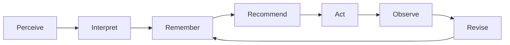

# Organizational Intelligence — Memory Architecture

**Target-state architecture**, written for the whole team. It answers five questions:

1. How is organizational memory maintained?
2. How does the AI retrieve from it?
3. How big can memory get — can we give the AI _absolutely everything_ about the organization?
4. How does the AI work out what is relevant?
5. How do we make the AI actually intelligent?

Companion to [What it is](../product/intelligent-org-features.md) (what this serves) and
[Design](./intelligent-org-design.md) (where each layer lives on Buzz). This document is the
reasoning behind the layers; the design is the placement; the
[Protocol](./intelligent-org-protocol.md) is the wire format.

> **Revision note (2026-09-14).** First written on 2026-08-20 against the Hypha platform, when
> work was modelled as funded _mandates_ with _pots_ and _stewards_. Sections 0–7 stand. Section
> 8 has been rewritten onto the current model — one recursive work tree, five proposal kinds,
> no money on work items — and section 9 pruned accordingly. Cost figures in §3–§4 come from a
> measured Hypha cost model (`docs/hypha-ai-cost/`, hypha-web) and are order-of-magnitude
> guidance, not Buzz measurements.

---

## 0. The core idea

An organization is intelligent to the degree it can reliably run one loop:

Most AI products build only **Recommend**, wired directly to a model, and call it intelligence. It
isn't — it's autocomplete with company data. The intelligence lives in the loop being _closed_: the
organization observes what happened after it acted, and revises what it believes.

This has one strategic consequence worth stating plainly:

> **The model is a commodity. The memory and the loop are the asset.**

Our own cost analysis shows a ~24× price spread between models of broadly comparable quality, and
the frontier moves every few months. Anything we build that depends on a specific model is
temporary. What no competitor can replicate is a curated, versioned, human-approved record of what
_this_ organization believes, plus the history of what it tried and what happened. That is what we
are building. The model is a rented interpreter for it.

---

## 1. Four layers of memory

Almost every failed AI-memory project fails by conflating these. They have different sizes,
different writers, different lifespans, and — critically — different rules about whether they are
ever allowed near the AI's context.

|        | Layer           | What it holds                                                                                          | Rough size                        | Written by                                    | Reaches the AI         |
| ------ | --------------- | ------------------------------------------------------------------------------------------------------ | --------------------------------- | --------------------------------------------- | ---------------------- |
| **L1** | Substrate       | chat messages, forum posts, call transcripts, uploaded files                                           | millions of tokens, grows forever | machines, automatically                       | **never directly**     |
| **L2** | Activity ledger | typed timestamped facts: _ticket done_, _project approved_, _offer declined_, _proposal settled_       | large, grows forever              | the relay, on every state change              | **only as aggregates** |
| **L3** | Semantic memory | what the organization believes: **mission, vision, objectives, strategy** — four short, versioned texts | **small — four documents**        | humans confirm every version; AI only drafts  | **always, in full**    |
| **L4** | Decision memory | recommendation → action → outcome chains; what we tried, what happened, what we now think instead      | medium                            | the relay, on state change                    | **selectively**        |

Where we stand on Buzz: **L1 exists** — the relay's event store already holds every message,
post, file, and huddle event with a signed author and a stable id, indexed for full-text
search. L2, L3, and L4 are specified in the [Protocol](./intelligent-org-protocol.md) and not
yet built. All three are ordinary projections of signed events — inexpensive to build, and they
are what make the loop closeable.

The single most important design rule follows from this table:

> **L3 holds interpretation. It never holds readings.**

Balances, vote counts, and membership numbers change constantly and are always fetched live at
question time. If a number gets written into a memory document, the AI will confidently recite a
stale figure forever. Direction says _"we are over-exposed to a single funding source"_; it never
says _"we hold 43,000 USDC"_.

A second rule carries equal weight, and it governs where memory draws its authority from:

> **Deliberative artifacts record what the organization believes about itself. Behavioural evidence
> records what it did. Where the two disagree, the disagreement is the finding.**

L3 is deliberative — direction is the organization's self-image. People posture in governance
rooms, and a strategy line records intent rather than outcome. An intelligence built mainly from
it becomes a very sophisticated model of how an organization would like to be seen.

The corrective is behavioural. Tickets actually closed against tickets promised, offers accepted
against offers declined, payments actually settled against payments proposed — what people _do_
is the least dishonest signal an organization emits, and on Buzz every one of those facts is a
signed event. That is L2, which is why the ledger is a foundation rather than deferred plumbing.

Two consequences for how the system should behave:

- **Anchor interpretation to evidence.** An objective no root item cites is an intention. An
  objective whose date is near with nothing under it should be surfaced for review, not quietly
  retained as belief.
- **Treat the gap as the product.** The distance between what an organization committed to (L3)
  and what its ledger shows it did (L2) is the most valuable thing this system can show a member —
  and it is invisible to everyone today precisely because nobody holds both halves at once. Move 1
  and the weekly gap scan in the design are this rule, made operational.

---

## 2. How memory is maintained

Memory quality is a governance process, not a storage problem. The lifecycle:

**Capture.** Raw material accumulates in L1 continuously. Nothing is curated at this stage.

**Propose.** Something — the AI, a connected app, or a person — proposes that the organization
should _know_ something. The AI's default is always to propose, never to publish. This is the
critical guardrail: memory an AI can silently rewrite launders hallucination into institutional
truth, which is strictly worse than having no memory at all. On Buzz this is structural: the
agent has no event kind that writes L3.

**Approve.** A Shaper reviews the proposed change against the current version and accepts, edits,
or rejects it. This moment is where human judgment enters the corpus, which makes it the most
valuable data we collect — we record the _edits_ approvers make (an amended draft), not just the
yes/no.

**Version.** The approved change is written as a new version with a pointer to what it
supersedes. Old versions stay readable forever — every version is a passed proposal on the
relay. This is what lets the organization ask "what did we believe in March, and who changed it,
and why?"

**Consolidate.** Objectives are redrawn, not appended: when one is reached or dropped the agent
proposes the new list, and Shapers confirm. This is the mechanism that keeps L3 small, and it is
triggered by the ledger (a project closing), not by a background job nobody sees.

**Retire.** A struck objective or a withdrawn strategy line is gone from the head but present in
every earlier version with the decision that removed it. Nothing is deleted.

Two properties every belief carries:

- **Provenance** — which proposal produced it, who confirmed it, when, and from what talk.
- **A falsification condition** — what would make this wrong? For an objective it is built in:
  the line has a date and a set of items that cite it. A belief with no stated way of being wrong
  can never be revised, and will quietly rot.

### The invariant that matters most

> **L3 must stay small enough that a person could read all of it in an afternoon.**

This is not an efficiency target, it is what makes the memory trustworthy. A corpus nobody can
audit is a corpus nobody should rely on. The current model fixes L3 at four artifacts and asks
that `objectives` hold three to seven lines. If a community wants a fifth artifact, that is a
protocol change to argue for, not a slot to fill.

---

## 3. How the AI retrieves — the context budget

We do not "search a big pile." We **spend a fixed budget** on every turn, filled in a defined
order. The ordering is the design.

With L3 fixed at four short texts, the first rule is simple: **the whole of L3 is always in the
prompt.** Four artifacts of a page or two each are 2,000–6,000 tokens. There is no retrieval
lottery for what the organization believes.

The subtler rule — the one that answers most of the difficulty — governs everything else:

> **Always send the _map_. Send the _contents_ only on demand.**

For L2 the map is aggregates (open items by state, offers past their window, done this week);
the contents are ledger rows, fetched when a draft needs receipts. For L1 the map is the
channel list and recent activity; the contents are messages, fetched by search when the agent
needs to cite one. The model chooses from a short labelled menu, which is something models are
extremely reliable at, rather than guessing search keywords and hoping. This is why we do not
need a vector database to get good behaviour.

A typical turn, budgeted:

| Slice                                                                 | Tokens       | Always present? |
| --------------------------------------------------------------------- | ------------ | --------------- |
| System prompt for the move being run                                  | 2,000        | yes             |
| The four direction heads, in full                                     | 4,000        | yes             |
| Current state — open work aggregates, Shapers, offers pending         | 700          | yes             |
| What changed since the last run of this move (ledger since)           | 1,000        | yes             |
| The trigger's context — a channel window, a subtree, a diff           | 4,000        | per trigger     |
| Relevant L4 — earlier drafts on this gap key and how they fared       | 1,000        | on demand       |
| Selected L1 receipts (messages the draft will cite)                   | 2,000        | on demand       |
| **Total**                                                             | **≈ 15,000** |                 |

The first four slices are stable between runs, which makes them ideal for prompt caching (cached
reads run 60–80% cheaper on most hosts).

If L3 ever outgrows "four short texts", the index-then-select pattern returns: send one line per
artifact, load bodies by name. Nothing else in the design changes.

---

## 4. How big can memory be? Can we provide _everything_?

This is the question that most needs a real answer, so here is the arithmetic.

**The curated memory of an organization is small.** Four artifacts of a page or two each. Even a
generous reading of "what we believe" — the four heads plus their last few versions and the
decisions that produced them — is tens of thousands of tokens. Every current frontier model has a
context window several times larger than that. So yes: technically, we could put the
organization's entire belief system into every single request, and we do.

**The raw substrate is not small, and never will be.** A single active organization generates on
the order of **one to three million tokens of chat and transcript per year**, growing every year.
That is many times the curated corpus in year one alone, and the ratio worsens indefinitely.

So the honest formulation of what we can offer:

> **We can give the AI everything the organization _believes_. We can let it query everything the
> organization has _done_. We will never send it everything the organization has _said_.**

L3 goes in whole. L2 is queried and arrives as aggregates and rows. L1 is reachable only by
explicit drill-down into a specific message, transcript, or file — and only to produce a receipt.

### Why we should not send everything even when we can

There are two arguments, and the weaker one is about money.

**Cost** — at 15,000 tokens per run a typical organization is affordable on any tier; at 60,000+
per run, premium models get expensive fast. But this argument erodes every year as prices fall, so
we should not build the architecture around it.

**Attention** — this is the durable argument. A model's ability to use a fact _degrades_ as that
fact is buried in more undifferentiated context. The same document that produces a sharp answer in
a 4,000-token context produces a vague one inside 60,000 tokens of everything-else. Filling the
window is not the same as informing the model.

Which yields the principle:

> **Curation is an accuracy requirement, not a cost optimization.**

We keep memory small because it makes the AI _better_, and it happens to also make it cheaper. If
inference were free tomorrow, this architecture would not change.

---

## 5. How the AI works out what is relevant

Relevance is decided in a fixed order, cheapest and most reliable signals first. A memorable
shorthand: **pinned, changed, nearby, named, fresh, similar.**

1. **Pinned** — the four direction heads are always in context. Not a ranking decision.
2. **Changed** — the ledger says what actually moved since the last run, weighted by whether it
   touches an open item or an objective near its date. This is deterministic, and it is where
   most genuinely useful drafts come from. _Trend beats snapshot._
3. **Nearby** — what is linked to the trigger: the item a message mentions, the objective a root
   cites (`objective_ref`), the channel a project talks in, the subtree under a held item.
4. **Named** — the model asks for a specific item, version, or channel window by id.
5. **Fresh** — prefer the head version; never load a superseded direction version unless the
   question is explicitly historical.
6. **Similar** — semantic search by embedding. **Deliberately last, and used only for
   deduplication** (is this draft the same gap as an open one?), never for truth. Full-text
   search (NIP-50) covers finding receipts.

Building steps 1–5 first is not a compromise on the way to "real" retrieval. Steps 1–5 are more
accurate, fully explainable, and free. Step 6 is an optimization for scale we do not have.

---

## 6. How we make the AI intelligent

Four ingredients, and the model is not one of them.

**Grounding — it knows this organization.** Everything it says is anchored in L3 and cites the
ledger rows and messages it drew on. An uncited recommendation is an opinion, and the
organization already has plenty of those. On Buzz the relay refuses a draft whose receipts do not
resolve.

**Salience — it knows what changed.** Detection comes from state changes and thresholds on the
ledger, not from a model. This is the difference between advice and a horoscope. It is worth being
explicit about how the work divides:

| Job                                  | Do it with                          | Because                                                             |
| ------------------------------------ | ----------------------------------- | ------------------------------------------------------------------- |
| Detect that something changed        | relay state events and ledger rules | must be reproducible, auditable, and cheap enough to run constantly |
| Decide whether it matters            | rules plus the four direction heads | needs to be inspectable when it gets it wrong                       |
| Explain what it means and what to do | the language model                  | requires judgment and phrasing, which is what models are for        |

The mistake to avoid is using a model as the trigger, which is non-deterministic, unauditable,
and expensive to run continuously. _Rules trigger; models explain._

**Judgment — it knows how this organization decides.** Decision memory means the AI can say "you
faced this in March, chose that, and here is how it turned out." No general-purpose model has
access to that, and it is the thing that makes advice feel like it came from a colleague rather
than a consultant.

**Feedback — it knows whether it was right.** Every draft records whether a human accepted,
amended, or declined it, and why. That number is simultaneously our product KPI and the loop's
error signal. Below roughly a third acceptance, the channel is noise and should be switched off
rather than tuned — because a low-quality proactive channel is not a neutral placeholder. It
spends the attention budget you need for the real thing. The
[AI evaluation plan](../plans/intelligent-org-ai-evaluation.md) turns this into pass/fail bars
per move.

And the delivery contract, which is where intelligence becomes visible or fails:

> Every draft must name **who can make it real**, state **one specific thing to do**, and **cite
> the evidence** it rests on. If it cannot do all three, it is not sent.

---

## 7. Anti-patterns we are choosing against

Each of these is a plausible, popular design that we are consciously rejecting.

- **Vector-database-first memory.** Opaque, unauditable, unmaintainable by the organization itself.
  We use readable text that a Shaper can correct. Embeddings are a dedupe tool, not a memory.
- **Letting the AI write memory directly.** Turns model error into institutional belief with no
  audit trail. Propose-then-approve, always — enforced by the protocol, not by convention.
- **A model as the proactive trigger.** Non-deterministic, unexplainable, and costly to run
  continuously. Rules trigger; models explain.
- **Unbounded accumulation.** "Store everything, retrieve later" produces a corpus nobody trusts
  and a retrieval problem that gets harder forever. L3 is four texts.
- **Numbers inside memory documents.** Guarantees confident stale answers. Volatile state is always
  fetched live.
- **Notification per event.** Destroys the attention budget. Buzz's default is zero
  notifications; the org agent must not be the exception.
- **Escalating by default.** Sending anything uncertain to a vote feels safe and is not. It
  manufactures approval fatigue, which then degrades the votes that actually matter. Route to the
  lightest channel that fits — see §8.
- **Measuring activity.** Drafts created and messages sent are vanity metrics that actively
  reward the wrong behaviour. Measure acceptance and outcomes.

---

## 8. Decision rights — what becomes a proposal

An intelligent organization is not one that decides more things together. It is one that knows
which things need deciding together. If every recommendation can become a proposal, approval
fatigue sets in, participation collapses, and the votes that genuinely matter get rubber-stamped
alongside the ones that don't. **Protecting the vote channel is a core architectural concern**, not
a governance nicety, because the AI will be generating candidate decisions faster than any previous
system did.

### The test

A decision needs the Shapers only on **yes to both**:

1. **Does it commit shared resources or change shared rules?** Shared means money leaving the
   organization, its direction, who is a member, who is a Shaper, or a new root of work. If no,
   it is operational and should never reach a vote.
2. **Is it hard to reverse, or large relative to our capacity?** If no, it belongs to whoever
   holds the work it sits under, with a record.

The first question is a claim about rights — people should have a say over decisions whose
consequences land on them and who are not otherwise in the room. The second is what keeps that
principle from consuming the organization.

### The answer, fixed

In the current model the test has already been applied, once, and the result is the protocol.
**Exactly five things are proposals**; everything else is either a holder's call or just logged.

| Level | Mechanism                                                                    | What lives here                                                                                                   |
| ----- | ---------------------------------------------------------------------------- | ----------------------------------------------------------------------------------------------------------------- |
| 0     | Just do it; the ledger records it                                            | Work inside an item you hold: split it, offer pieces, mark yours done, set a child's date                        |
| 1     | The holder of the parent decides                                             | Promote a child, offer it, take it back — the person one level up, never a vote                                  |
| 3     | **Shapers decide** — the five proposal kinds, threshold per kind (`39103.rules`) | `project` (a new root), `dri` (name a holder by vote), `money` (out only), `direction` (a new version of one of the four), `join` (a person) |
| 4     | Shapers decide, higher bar by default                                        | Who is a Shaper; the decision rules themselves (`io_shaper_set`)                                                 |

Level 2 — _visible for N days, proceeds unless someone objects with a reason_ — is the channel
most organizations lack and the one that absorbs most over-escalation. It is **not built** in
the MVP: every Shaper decision is an explicit vote. It is the obvious next rule value
(`silence_after: <secs>`) for `39103.rules` once the five kinds have real traffic and the tally
shows which of them pass near-unanimously without discussion. Those were not decisions; they
were level-2 items taxing everyone's attention.

### Constituencies

The levels above vary _how much_ agreement a decision needs. A second axis varies _whose_
agreement it needs. In the MVP there is one electorate — the Shapers — and every proposal kind
reads its threshold from `39103.rules`. Named constituencies (funders with reserved matters,
beneficiaries who must be consulted but hold no vote) are not modelled. The discipline to keep
when they come: **being heard and having authority are separate grants, and most edge
stakeholders should get the first without the second.** A funder who can file an observation
into a Shaper's DM is well served; a funder who can direct operations has quietly become
management.

**Shaper is itself a grant.** The community owner is the first. After that, only Shapers decide
who is a Shaper. Founding the organization does not keep it forever. Shapers decide direction,
roots, DRIs by vote, money out, and joins. They do not run tickets, and they do not hold work by
virtue of being Shapers.

### Projects, not transactions

The highest-leverage move is to change what a vote is _about_.

> **Whether something needs a vote is a property of its relationship to existing work, not of the
> request.**

Take "we want feature X, we need Y to do it". Its level depends entirely on something outside
the request:

- A live project already covers it and someone holds that project → **level 0/1**. The holder
  splits their item and offers a piece. Not a governance event; them doing their job.
- Nothing live covers it → the AI drafts a **root**, and the Shapers vote on the project, once.
  The next thirty decisions inside it are then level 0/1.
- It changes what the organization is trying to do → it is a `direction` proposal, and the root
  follows from the new objective, not the other way round.

So one vote on "this project, this end date, this objective" retires dozens of future votes.
Projects are the compression mechanism for governance in the same way that four short artifacts
are the compression mechanism for memory. Money is not on the project — it is a separate,
out-only decision when a piece of work is done — which is what removes the two hardest
questions (how budgets cascade, salary vs. per-piece) from the model entirely.

**Same object at 10 members and at 10,000.** With ten people, Shapers approve two or three
roots and hold most of them. With ten thousand, Shapers still approve a handful of roots; holders
split to whatever depth the work needs, and every split is level 1. The Shaper set does not grow
with membership; the tree does.

### Where new roots come from

A root is created as **one Shaper decision**, usually on an AI draft: this title, this brief,
this end date, this objective it serves, and — if the agent can name one — a suggested holder.
Direction that is not a job — mission, who is a Shaper, join rules — stays memory and is not
turned into a root. If a direction change implies new work, the root draft follows from the
confirmed version (move 1); it is not a second thing to argue about in the same breath.

Roots should be created from observed need, not asserted need. The mechanism is the gap: an
objective no root cites, a need heard in a room that no held item covers.

**A ticket with no holder is a measurement, not a failure — and it is enough.** Left alone,
unrouteable work silently lands on whoever is most responsive, which hides the shortage and burns
out the conscientious. The AI names the gap on the card (_open — no holder_), suggests a person
when it can, and a Shaper can name one by vote when the offer path stalls. Further needs in the
same gap attach to the same open draft (one draft per gap key); they do not open a second card.

Three constraints on the matcher itself:

- **Propose, do not allocate.** Work cannot be assigned, only made visible to the person most
  likely to take it. Suggested holder, reasoning shown, accept or decline theirs alone. The `dri`
  vote is the one exception, and it takes the Shapers to use it.
- **Reserve a minority of routing for stretch matches.** Matching purely on demonstrated history
  ossifies roles and quietly creates single points of failure. Capabilities held by exactly one
  person are a risk the system is well placed to notice and surface.
- **Capacity is declared, not inferred.** Do not build a load model. Most of what constrains a
  contributor is off-platform and therefore unmeasurable here, and the tempting proxy — open item
  count — penalises whoever takes on slow work. Store a coarse, revisable, self-set limit on the
  profile; use it to gate suggestions rather than to score fit; and let observation surface a
  discrepancy to the person without ever overriding them.

### What this means for the AI

Routing is a more valuable capability than drafting. For every heard need the AI should propose
the **lowest** level that fits — a child under the nearest held item before a new root, a new
root before a direction change — name the item or objective it believes covers it, and treat a
Shaper proposal as the exception it must argue for. A human can always escalate upward; the AI's
bias must run downward.

This also yields a governance health metric worth tracking: **what share of proposals pass
near-unanimously with no substantive discussion?** A high rate is a symptom of a missing level 2,
not of a healthy organization.

---

## 9. Open questions

Worth resolving before or during build, but not blocking the shape above.

1. **Redraw cadence for `objectives`.** Only on a project close, or also on a calendar rhythm
   when nothing has closed for a quarter?
2. **Per-artifact size limit.** Direction heads are meant to be always-loadable; something near
   4,000–8,000 tokens each seems right. Enforced at the relay, or a soft limit the agent respects?
3. **Where decision outcomes come from** — inferred from the ledger at review time (does the
   objective's line still stand? did the follow-up happen?), or explicitly recorded by a Shaper at
   close? Inference scales; explicit recording is accurate. The review card is where both meet.
4. **Cross-community memory** — a person's profile spans communities; should anything else? Default
   no.
5. **Model routing.** A premium tier for interactive DM work and a cheap tier for the scheduled
   moves. Which model per tier, and does Buzz Mesh cover the cheap tier?
6. **Level 2.** When the tally shows kinds that pass silently, what does the silence window look
   like, who may object, and does one reasoned objection escalate to a vote or block outright?
7. **Who sets the level when the AI and a member disagree?** A member can escalate upward (open a
   root instead of a child). Should anyone be able to route _downward_ out of a proposal?

---

## Related

- [The Intelligent Organization — What it is](../product/intelligent-org-features.md) — what this serves
- [The Intelligent Organization — Design](./intelligent-org-design.md) — where each layer lives on Buzz
- [The Intelligent Organization — Protocol](./intelligent-org-protocol.md) — the events that carry L2, L3, and L4
- [The Intelligent Organization — AI Evaluation Plan](../plans/intelligent-org-ai-evaluation.md) — the feedback loop as pass/fail bars
- [The Intelligent Organization — Current State](./intelligent-org-current-state.md) — what Buzz has today
- [archive/user-journeys.md](../archive/user-journeys.md) — the August model this section 8 used to describe (mandates, pots, stewards); superseded
